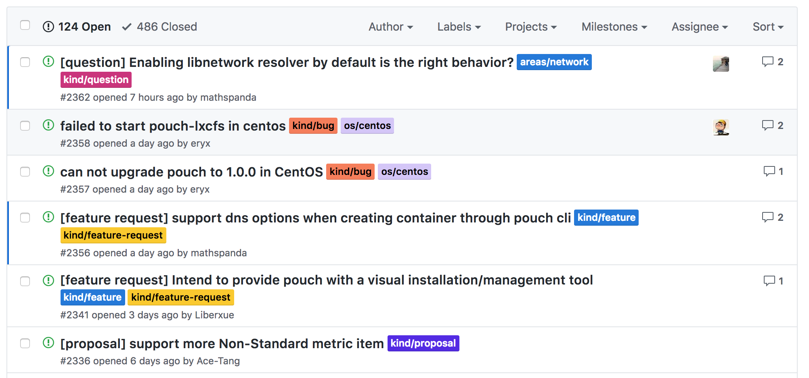

# pouchrobot
[](https://www.apache.org/licenses/LICENSE-2.0.html)
[](https://godoc.org/github.com/pouchcontainer/pouchrobot)
[](https://goreportcard.com/report/github.com/pouchcontainer/pouchrobot)

pouchrobot is a cute robot to help collaboration in any open source projects become better. Also there is a GitHub user [pouchrobot](https://github.com/pouchrobot) who is the exact instance of project pouchrobot.

Everyone knows that collaboration of a software project is quite trivial, repeated and time-costing. If owner of a project needs to guarantee the efficiency of development and testing, or releasing, he must invest some human resources there. However, if a robot could do him a favor to automatically handle collaborating affairs, it could bring lots of convenience. Fortunately pouchrobot is such an intelligent robot to take the role of a GitHub user account to automatically do what a human would act manually to manage the project.

> NOTE: pouchrobot GitHub user needs to gain some certain access (READ/WRITE) to the target open source project according different features.

## Features

pouchrobot could help finish lots of work in open source project on GitHub. If we divide all these practical feature into categories, we can find the following four parts:

* issue/pull request triage
* weeklyreport auto generating via a filed issue
* some doc auto generation for project via pull request
* friendly notice for pull request's status change

### issue/pull request triage

When an active participant files an issue or puts forward a pull request, it would be much better for the community to quickly notice which aspect the issue/pr is related to. Clear information makes community feel more straightforward. 

pouchrobot will triage issue/pr into different aspects. The working steps are like following:

* First, it analyzes the issue body or pull request body to extract useful information. 
* Second, it maps the useful information to some fixed rules. 
* Third, it attached labels of project to the issue/pr.

We can see the real effect (the colored outlined labels) from the following graph.



> TODO: we are going to make pouchrobot have abilities to import some certain fixed labels at the very beginning as a step of label initialization.

### auto generated weekly report

Weekly report means something for an open souce project. It conludes what happened in the past week in repo. While collecting these information is quite bothering. The good news is that pouchrobot have the ability to take care of this part via a newly filed issue.

Currently what covered in weekly report are:

* repo star/watch/fork summary and change
* pull request update divided into feature, bugfix, doc, test and others
* code review statistics from community participants
* contribitors newly joining the project

The following link contains a typical weekly report generated by pouchrobot: [Weekly Report of PouchContainer from 2018-10-13 to 2018-10-20](https://github.com/alibaba/pouch/issues/2337).

### auto generated documentation

We know that develops enjoy inventing awesome softwares via codes very much. However, a brilliant software contains not only great codes, but also instrument or document to attract end-users on board.

How about letting document editting be handled by pouchrobot via a pull request?

Currently only three kinds of document are covered:

* API document generation only for [swagger](https://swagger.io/)
* CLI document generation only for golang [cobra](https://github.com/spf13/cobra)
* repo's own CONTRIBUTORS file which records the emails for all contributors

### friendly notice for pull request's status change

* notice pull request submitter continuous integration failure via comments from [TravisCI](https://travis-ci.org/) and [CircleCI](http://circleci.com/)(TODO)
* notice pull request submitter to take a rebase action since too old to the master branch;
* notice pull request submitter pull request conflict when a conflicting pull request merged into master branch;
* automatically merge pull request when it meets the condition (TODO);
* support retest pull request according maintainer's order (TODO);

### Access requirement for features

|feature|Read access|Write Access|Admin Access|
|:-:|:-:|:-:|:-:|
|issue/pr triage|yes|yes|no|
|weekly report generation|yes|no|no|
|doc generation|yes|no|no|
|auto notice|yes|no|no|

> NOTE: attaching labels requires pouchrobot has write access of the repo.

## Architecture

pouchrobot acts as a daemon process on a third-party public cloud. When running, it would have three kinds of API communication:

* receive github webhook of project [Pouch](https://github.com/alibaba/pouch) when events happen;
* receive CI system webhooks, like travisCI and circleCI;
* fetch and deal with object on project, like issue, pull request, comments and so so;

Here is the simple communication architecture of pouchrobot:


## Quick Start

First of all, let us take a look at the command line usage of pouchrobot:

```
$ pouchrobot --help
Usage:
  A AI-based collaboration robot applied to open source project [flags]

Flags:
      --api-doc-path string   specifies where to generate the doc file corresponding to swagger.yml
  -c, --commits-gap int       commits gap between pull request and master branch; if the fact is beyond this number, request torebase (default 20)
  -h, --help                  help for A
  -l, --listen string         where does robot listen on
  -o, --owner string          GitHub username to which this robot connects
  -r, --repo string           GitHub code repository to which this robot connects
      --report-day string     weekly report generation day of a week (default "Friday")
      --report-hour int       weekly report generation hour on report-day (default 7)
      --root-dir string       specifies repo's root directory which is to generated docs
      --swagger-path string   specifies where the swagger.yml file locates
  -t, --token string          access token which identifies robot username in GitHub having write access on repo
```

pouchrobot is totally fitable in running a container. In this repo, we can find a Dockerfile to build the corresponding image. When finishing the building, the following command could help to setup a brand new robot:

> pouch run -d -v /root/newssh:/root/.ssh -p 6789:6789 pouchrobot:v1.0 pouchrobot -o alibaba -r pouch -l 0.0.0.0:6789 --token TOKEN

In which TOKEN is a github token for a specific user.

## Participating

You can contribute to pouchrobot in several different ways:

* To report a problem or request a feature, please feel free to file an issue.
* Of course, we welcome pull requests and patches. Setting up a local pouchrobot development environment and submitting PRs.

## Copyright and License

Copyright © 2017. All rights reserved.
