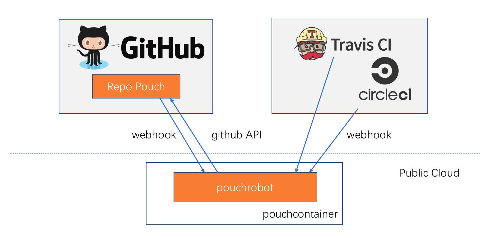

# pouchrobot

pouchrobot is a cute robot to help collaboration in project [Pouch](https://github.com/alibaba/pouch) become better. Also there is a GitHub user [pouchrobot](https://github.com/pouchrobot) who is the exact instance of project pouchrobot.

Everyone knows that collaboration of a software project is quite trivial, repeated and time-costing. If owner of a project needs to guarantee the efficiency of development and testing, or releasing, he must invest some human resources there. However, if a robot could do him a favor to automatically handle collaborating affairs, it could bring lots of convenience.

## Features

pouchrobot could help finish lots of work in open source project on GitHub:

* triage newly created issue into categories by attaching labels;
* triage newly submitted pull request into catagories by attaching labels;
* auto generate weekly report for project;
* auto generate api and commandline document;
* notice pull request submitter continuous integration failure via comments from [TravisCI](https://travis-ci.org/) and [CircleCI](http://circleci.com/)(TODO)
* notice pull request submitter to take a rebase action since too old to the master branch;
* notice pull request submitter pull request conflict when a conflicting pull request merged into master branch;
* automatically merge pull request when it meets the condition (TODO);
* support retest pull request according maintainer's order (TODO);

## Architecture

pouchrobot acts as a daemon process on a third-party public cloud. When running, it would have three kinds of API communication:

* receive github webhook of project [Pouch](https://github.com/alibaba/pouch) when events happen;
* receive CI system webhooks, like travisCI and circleCI;
* fetch and deal with object on project Pouch, like issue, pull request, comments and so so;

Here is the simple communication architecture of pouchrobot:

## Quick Start

pouchrobot is totally fitable in running a container. In this repo, we can find a Dockerfile to build the corresponding image. When finishing the building, the following command could help to setup a brand new robot:

> pouch run -d -v /root/newssh:/root/.ssh -p 6789:6789 pouchrobot:v1.0 pouchrobot -o alibaba -r pouch -l 0.0.0.0:6789 --token TOKEN

In which TOKEN is a github token for a specific user.

## Participating

You can contribute to pouchrobot in several different ways:

* To report a problem or request a feature, please feel free to file an issue.
* Of course, we welcome pull requests and patches. Setting up a local pouchrobot development environment and submitting PRs.

## Copyright and License

Copyright © 2017. All rights reserved.
